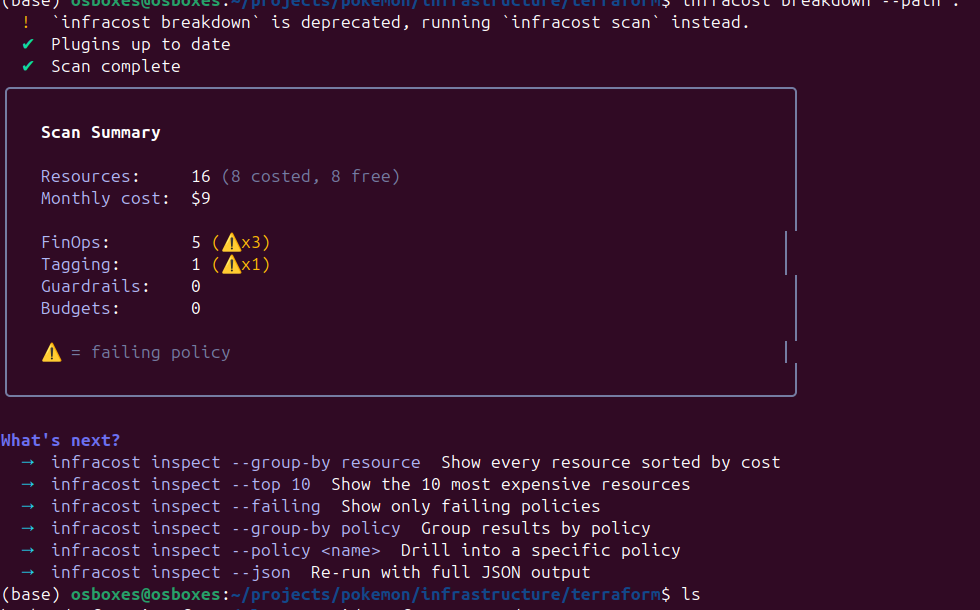
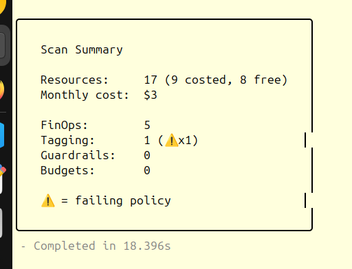

# Pokesearch


Pokesearch is a Node.js web app that lets users look up basic information about any Pokémon. It fetches live data from the [PokéAPI](https://pokeapi.co) and is deployed on AWS ECS Fargate via a fully automated CI/CD pipeline.

< --- IP start --- >
**Experience the application live: → [Demo](http://44.220.130.33:10000)**
< --- IP end --- >

---

## Table of Contents

- [Pokesearch](#pokesearch)
  - [Table of Contents](#table-of-contents)
  - [Tech Stack](#tech-stack)
  - [Architecture](#architecture)
  - [Terraform Infrastructure](#terraform-infrastructure)
    - [FinOps 💸](#finops-)
      - [Findings before optimization 🚨](#findings-before-optimization-)
      - [Optimization actions ✅](#optimization-actions-)
      - [Result after optimization 📉](#result-after-optimization-)
    - [Terraform workflow diagram](#terraform-workflow-diagram)
  - [CI/CD Pipeline](#cicd-pipeline)
    - [Pipeline Diagram](#pipeline-diagram)
    - [GitHub secrets required](#github-secrets-required)
  - [Why Fargate over ECS Express Mode](#why-fargate-over-ecs-express-mode)
  - [Project Structure](#project-structure)
  - [Usage](#usage)
  - [License](#license)
  - [Footer](#footer)

---

## Tech Stack

| Layer | Technology |
|---|---|
| Runtime | Node.js 24 |
| Web framework | Express |
| Templating | Pug |
| HTTP client | Axios |
| Container registry | Amazon ECR |
| Compute | AWS ECS Fargate |
| Infrastructure as Code | Terraform |
| CI/CD | GitHub Actions + OIDC |
| State backend | S3 + DynamoDB |

---

## Architecture

The project uses a **hybrid IaC + CI/CD approach**: Terraform owns the infrastructure shape and GitHub Actions owns the application lifecycle. Neither ever conflicts with the other.

```
┌─────────────────────────────────────────────────────────────────┐
│                          AWS (us-east-1)                        │
│                                                                 │
│  ┌──────────────────────────────────────────────────────────┐   │
│  │  VPC  10.0.0.0/16                                        │   │
│  │                                                          │   │
│  │  ┌─────────────────┐     ┌─────────────────┐            │   │
│  │  │ Public Subnet A │     │ Public Subnet B │            │   │
│  │  │  10.0.1.0/24    │     │  10.0.2.0/24    │            │   │
│  │  │                 │     │                 │            │   │
│  │  │  ┌───────────┐  │     │                 │            │   │
│  │  │  │  Fargate  │  │     │  (failover AZ)  │            │   │
│  │  │  │   Task    │  │     │                 │            │   │
│  │  │  │ :10000    │  │     │                 │            │   │
│  │  │  └───────────┘  │     │                 │            │   │
│  │  └────────┬────────┘     └─────────────────┘            │   │
│  │           │                                              │   │
│  │  ┌────────▼────────────────────────────────────────┐    │   │
│  │  │  Security Group: ingress :10000, egress *        │    │   │
│  │  └─────────────────────────────────────────────────┘    │   │
│  │                          │                               │   │
│  │              ┌───────────▼──────────┐                   │   │
│  │              │  Internet Gateway    │                   │   │
│  └──────────────┴──────────────────────┴───────────────────┘   │
│                             │                                   │
│  ┌──────────┐   ┌───────────▼──────┐   ┌─────────────────┐    │
│  │   ECR    │   │   ECS Cluster    │   │   CloudWatch    │    │
│  │ pokemon  │◄──│  pokemon-cluster │   │  /ecs/pokemon   │    │
│  │  -app    │   │                  │   │  (30d retention)│    │
│  └──────────┘   └──────────────────┘   └─────────────────┘    │
│                                                                 │
│  ┌──────────────────────────────────────────────────────────┐   │
│  │  IAM                                                     │   │
│  │  pokemon-ecs-execution-role  (pull images, write logs)   │   │
│  │  pokemon-ecs-task-role       (app-level AWS API calls)   │   │
│  └──────────────────────────────────────────────────────────┘   │
└─────────────────────────────────────────────────────────────────┘
```

---

## Terraform Infrastructure

All infrastructure is provisioned from `infrastructure/terraform/` using five purpose-built modules. Run once before any deployment.

```
infrastructure/terraform/
├── main.tf           ← Wiring layer: module calls + outputs only
├── provider.tf       ← AWS provider + version constraints
├── backend.tf        ← S3 remote state + DynamoDB lock
└── modules/
    ├── vpc/          ← VPC, subnets, IGW, route tables, security group
    ├── ecr/          ← ECR repository
    ├── iam/          ← ECS execution role + task role
    ├── ecs/          ← ECS cluster, CloudWatch log group, bootstrap task definition
    └── ecs_express_mode/ ← ECS Fargate service (lifecycle ignore_changes)
```

### FinOps 💸

To keep the workload cost-efficient without sacrificing reliability, I used Infracost as a FinOps validation layer to review the AWS footprint before and after optimization. This follows a proper cloud cost-governance workflow: identify waste, enforce policy-based guardrails, and right-size resources before they become a recurring operational expense.

I ran:

`infracost inspect --failing`

This surfaced the most impactful issues in the Terraform-defined architecture, including:

- ♻️ ECR lifecycle drift: the repository had no lifecycle policy, which meant stale container images were accumulating and increasing storage costs over time.
- ⚙️ ECS cost optimization: the task definition was flagged by Infracost to use Graviton instances rather than x86-based compute for better cost-performance on Fargate.

#### Findings before optimization 🚨

The initial review showed a monthly cost estimate of about $9, driven primarily by unnecessary image retention and non-optimized compute architecture.

The output flagged these recommendations clearly:

- `ECR - consider using a lifecycle policy`
- `ECS - consider using Graviton instances`

At this stage, the infrastructure was technically functional, but it was not yet aligned with a lean, production-grade cost model.

#### Optimization actions ✅

I applied the following changes:

- Added an ECR lifecycle policy to automatically remove stale images and reduce storage overhead.
- Switched the ECS task definition from x86 to ARM64 / Graviton-compatible architecture to improve price-performance on AWS Fargate.

#### Result after optimization 📉

After these adjustments, the estimated monthly cost dropped from roughly $9 to effectively $3 for the current idle workload profile.



After applying the lifecycle policy and the Graviton migration, the cost profile was reduced significantly:



This is a good example of practical FinOps in action: the stack remains operationally sound, but the cloud spend is reduced by eliminating waste, improving architecture efficiency, and aligning the workload with AWS’s more cost-effective compute model.

### Terraform workflow diagram

```
Developer
    │
    ▼
terraform init
    │
    ▼
terraform apply
    │
    ├──► module.vpc            → VPC + subnets + IGW + SG
    ├──► module.ecr            → ECR repository
    ├──► module.iam            → execution role + task role
    ├──► module.ecs            → cluster + log group + bootstrap task definition
    └──► module.ecs_express_mode → ECS Fargate service
                                   (lifecycle: ignore task_definition, desired_count)
    │
    ▼
Infrastructure ready — CI/CD takes over from here
```

---

## CI/CD Pipeline

A GitHub Actions workflow automates the build, test, and deployment process for every push to the `master` branch. It utilizes OIDC for secure AWS authentication, eliminating the need for long-lived credentials.

### Pipeline Diagram 

```
Push to master
      │
      ▼
┌─────────────┐
│   Job: Test │
│─────────────│
│ npm ci      │
│ node --check│
│ smoke test  │
└──────┬──────┘
       │ pass
       ▼
┌───────────────────────────────────────────┐
│            Job: Build & Deploy            │
│───────────────────────────────────────────│
│                                           │
│  1. Checkout code                         │
│                                           │
│  2. Configure AWS credentials (OIDC)      │
│     GitHub token → assume IAM role        │
│     (no AWS_ACCESS_KEY_ID stored)         │
│                                           │
│  3. Log in to Amazon ECR                  │
│                                           │
│  4. Build & push Docker image             │
│     tag: <commit-sha>  +  :latest         │
│     destination: ECR/pokemon-app          │
│                                           │
│  5. Render task definition                │
│     .aws/task-definition.json             │
│     IMAGE_URI_PLACEHOLDER → real ECR URI  │
│                                           │
│  6. Deploy to ECS                         │
│     register new task definition revision │
│     update pokemon-service                │
│     wait for stability                    │
│                                           │
└───────────────────────────────────────────┘
       │
       ▼
New container running in Fargate ✓
```

### GitHub secrets required

| Secret | Description |
|---|---|
| `AWS_REGION` | e.g. `us-east-1` |
| `GH_ACTIONS_ROLE_ARN` | ARN of the OIDC IAM role |
| `ECR_REPOSITORY` | `pokemon-app` |
| `ECS_CLUSTER` | `pokemon-cluster` |
| `ECS_SERVICE` | `pokemon-service` |

---

## Why Fargate over ECS Express Mode

ECS Express Mode is a simplified console wizard that abstracts away most configuration. It was intentionally **not used** here for several reasons:

- **Not Terraform-manageable** — Express Mode is a console-only experience. There is no `aws_ecs_express_*` Terraform resource, which makes it impossible to version-control or reproduce the infrastructure.
- **No lifecycle control** — the standard `aws_ecs_service` resource supports a `lifecycle { ignore_changes = [...] }` block, which is the critical mechanism that lets Terraform and GitHub Actions coexist without conflicting. Express Mode offers no equivalent.
- **Less observable** — standard Fargate integrates directly with CloudWatch Container Insights, structured log groups, and IAM roles with explicit policies. Express Mode bundles these with less transparency.
- **Production-grade requirements** — this project is built as a portfolio piece demonstrating real-world DevOps practices. Using the full Fargate service resource demonstrates understanding of the underlying primitives rather than relying on a wizard.

---

## Project Structure

```
pokemon/
├── .aws/
│   └── task-definition.json     ← ECS task definition template (CI/CD renders this)
├── .github/
│   └── workflows/
│       └── ci-deploy.yml        ← GitHub Actions pipeline
├── infrastructure/
│   └── terraform/               ← All IaC lives here
│       ├── main.tf
│       ├── provider.tf
│       ├── backend.tf
│       └── modules/
│           ├── vpc/
│           ├── ecr/
│           ├── iam/
│           ├── ecs/
│           └── ecs_express_mode/
├── src/
│   ├── public/
│   │   ├── axi.js               ← Axios HTTP client (browser-side API calls)
│   │   └── styles.css
│   ├── views/
│   │   └── index.pug            ← Pug template
│   ├── server.js                ← Express server
│   └── package.json
├── Dockerfile
├── .gitignore
└── README.md
```

## Usage 

Once the application is running, you can access it via your web browser.

1.  **Open your browser** and navigate to `http://localhost:10000`.
2.  **Search for a Pokémon:** Enter a Pokémon's name in the search bar and press Enter.
3.  **View Details:** A modal will display detailed information about the Pokémon.
4.  **Navigate Pages:** Use the pagination buttons to browse through different pages of Pokémon.

---

## License 

This project is not currently under a specified license. Please refer to the repository for details.

---

## Footer

© 2023 [andresafag/pokemon](https://github.com/andresafag/pokemon) | Developed by [andresafag](https://github.com/andresafag)

